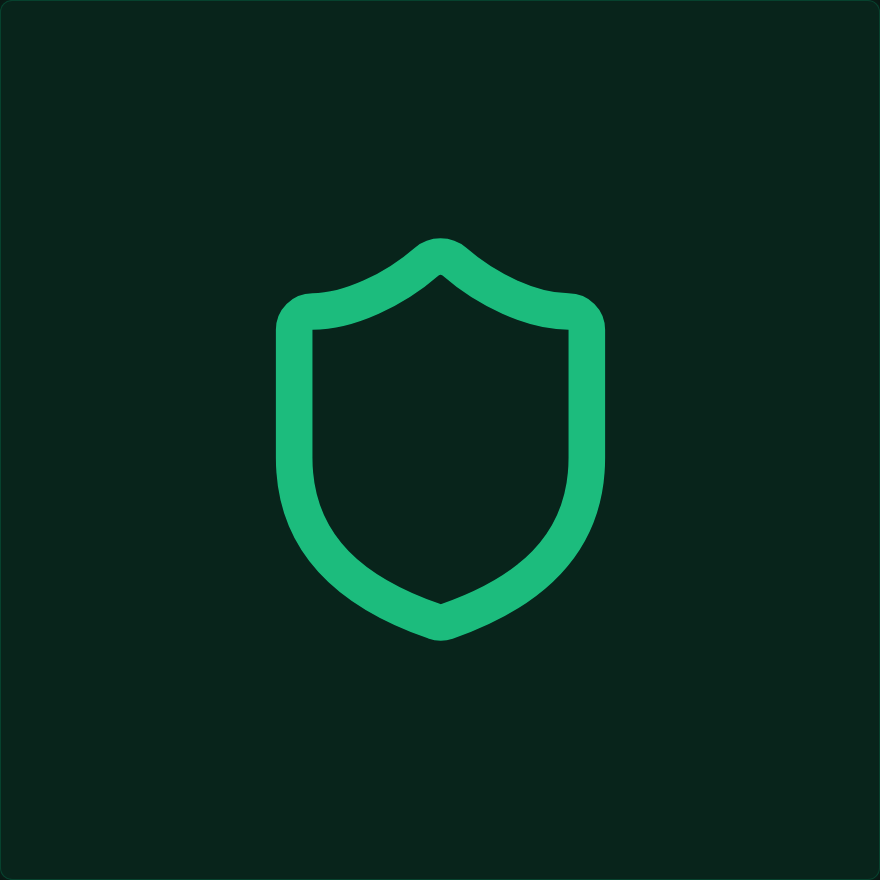

<div align="center">



# Notvex

**Encrypted notes, 100% local. No account, no server, no cloud.**

Your notes live in a single encrypted file on your own disk. No one else — not even Notvex — can read them.

<a href="https://notvex.vercel.app/download" target="_blank"></a>
<a href="https://notvex.vercel.app/download" target="_blank"></a>
<a href="https://notvex.vercel.app/download" target="_blank"></a>


</div>

<p align="center">
  
</p>

## What is Notvex

Notvex is a desktop app for taking notes **privately and encrypted**, without relying on any external service. No accounts, no cloud sync, no telemetry: every note is stored encrypted in a single file (`vault.nvx`) that you fully control. Copy it, move it, back it up, or carry it on a USB drive — it stays just as secure as it is on your disk.

Under the hood, Notvex combines a SQLCipher database (AES-256 page-level encryption) with a second layer of field-level encryption (XChaCha20-Poly1305) on each note's title and content, deriving the master key with Argon2id. The result: even if someone gets hold of the vault file, without your password (or your recovery key) the content is indistinguishable from random binary noise.

Built with Electron + React + TypeScript, for anyone who wants a fast, minimal, and verifiable markdown note-taking app — all the code is auditable, with no black box and no remote backend.

## Key features

🗒️ **Notes**
- Create, edit, and autosave markdown notes — no manual saving required.
- Pin important notes so they always show up first.
- Trash with restore or permanent delete, plus a one-click "empty trash".
- Full-text search across all notes.

🏷️ **Tags**
- Create color-coded tags and assign them to notes from the editor or the command palette.
- Filter the note list by one or several tags at once.
- Per-tag note counts in the sidebar.

📝 **Markdown editor**
- CodeMirror 6-based editor with syntax highlighting (Andromeda theme) and a formatting toolbar (bold, italic, code, headings, lists, checklists, blockquotes).
- Right-click context menu with the same formatting actions plus "clear formatting".
- Live preview while you type (lists, tables, and checkboxes rendered inline as you edit).
- Dedicated reading view (`Ctrl+Shift+E`) that renders the full markdown with GFM support, syntax-highlighted code, and copy-to-clipboard.

🧩 **Command palette & shortcuts**
- Command palette (`Ctrl+K`) to jump to recent notes, create notes, toggle views, show the trash, or lock the vault without touching the mouse.
- Keyboard shortcuts for the most common actions (see table below).

🧩 **Multi-vault**
- Create or open multiple vaults and switch between them from a selector with "recent vaults".
- Export a vault backup ("save a copy as") at any time.

🛠️ **Updates**
- Built-in update checking (electron-updater) with download progress and in-app install.

🔒 **Security** — see the dedicated section below.

## Security and privacy

Notvex is built on the principle that **the vault file, by itself, should never reveal anything**, not even sensitive metadata.

- **SQLCipher**: encrypts the entire SQLite database with AES-256 at the page level.
- **Field-level encryption**: on top of SQLCipher, each note's title and content are individually encrypted with **XChaCha20-Poly1305** (random nonce per field). Tag names are kept as plain text *inside* the already SQLCipher-encrypted database — a deliberate tradeoff so tags can be queried via SQL without decrypting every note.
- **Argon2id** derives the master key from your password, auto-calibrated on each machine to take ~1.5s (automatically picking the strongest memory/iteration tier your hardware can sustain within that time).
- **24-word BIP39 recovery key**, generated when the vault is created (and regenerated on every password change or key-file change): it's the only way to recover access if you forget your password.
- **Optional key file**: any file can be used as a second unlock factor, combined with your password during key derivation. It can be added or removed at any time.
- **The master key is never written to disk**: it lives only in the main process's memory, pinned with `VirtualLock`/`mlock` to prevent the OS from paging it to swap, and is wiped (`sodium.memzero`) when the vault is locked.
- **Configurable auto-lock** (never / 5 / 15 / 30 / 60 min), plus an immediate forced lock on system sleep, OS lock-screen, or when the window loses focus.
- **Screen capture protection**: by default, the window is hidden from screenshots and screen sharing (`setContentProtection`), toggleable from settings if you need it.
- **Progressive delay** after failed unlock attempts.

> [!WARNING]
> **If you lose your master password AND your recovery key, your notes are unrecoverable.** There is no account, no server, no way to reset access. Store your recovery key in a password manager or somewhere physically safe.

## Tech stack & ecosystem


The app is organized into three separate processes, orchestrated with **electron-vite**:

- **`src/main`** — Electron main process (Node.js): all vault cryptography, SQLCipher access, and the IPC handlers.
- **`src/preload`** — `contextBridge` bridge that exposes only the `window.notvex` API to the renderer (no Node.js integration).
- **`src/renderer`** — the React 18 + Tailwind CSS 4 + shadcn/ui interface, which never touches cryptography or SQL directly.
- **`src/shared`** — TypeScript types shared across all three processes.

This isolation is intentional: the renderer can never run encryption or SQL code on its own, only through explicitly defined IPC channels.

## Installation & development

### Prerequisites

- [Node.js](https://nodejs.org/) ≥ 22
- [pnpm](https://pnpm.io/)
- Windows: Visual Studio Build Tools with the "Desktop development with C++" workload (required to compile `@journeyapps/sqlcipher`)

### Install

```bash
git clone https://github.com/GFrancV/notvex.git
cd notvex
pnpm install
```

`pnpm install` automatically rebuilds `@journeyapps/sqlcipher` for the installed Electron version.

### Run in development

```bash
pnpm dev
```

### Build

```bash
# Windows
pnpm build:win

# macOS
pnpm build:mac

# Linux
pnpm build:linux
```

Installers are output to `dist/`.

## Keyboard shortcuts

| Shortcut | Action |
|---|---|
| `Ctrl+K` | Command palette |
| `Ctrl+L` | Lock vault |
| `Ctrl+N` | New note |
| `Ctrl+Shift+F` | Focus search |
| `Ctrl+Shift+E` | Toggle reading / edit view |
| `Ctrl+Shift+T` | Show trash |
| `Ctrl+Enter` (in search box) | New note |
| `Esc` | Deselect note / close popovers |

## Vault files

Notvex stores everything in a **single file** chosen when the vault is created:

| File | Contents |
|---|---|
| `vault.nvx` | Encrypted container: header (Argon2id salt, KDF tier, recovery blob, integrity HMAC) followed by the full SQLCipher database |
| `vault.nvx.lock` | Temporary PID-based lock file while the vault is open — removed automatically on close |

Opening `vault.nvx` with a hex editor or any SQLite tool without the correct key shows only encrypted bytes — there is no way to read notes or metadata without going through the unlock process.

## Contributing

1. Fork the repository
1. Create a descriptive branch (`feat/feature-name`, `fix/bug-name`).
2. Follow the project's conventions:
   - UI components: always reuse what already exists in `src/renderer/src/components/ui/` before building something new.
   - Never hardcode colors — use the semantic Tailwind tokens defined in `main.css`.
   - Dark mode only — no `dark:` variants or light-theme logic.
   - All renderer↔main communication goes through IPC (`ipc-handlers.ts` → `preload/index.ts` → `lib/ipc.ts`); the renderer never imports cryptography or SQL modules directly.
3. Before opening a PR, run:
   ```bash
   pnpm validate   # typecheck + lint + format:check
   ```
4. Use [Conventional Commits](https://www.conventionalcommits.org/) in lowercase (`feat:`, `fix:`, `chore:`, etc.), max 72 characters in the subject.
5. Open the PR against `main`. CI (`react-doctor` and the release workflow) runs automatically on every push/PR.

Found a security bug? Report it privately instead of opening a public issue.

## License

This project is licensed under the AGPL-3.0 license. See [`LICENSE`](./LICENSE) for the full text.
